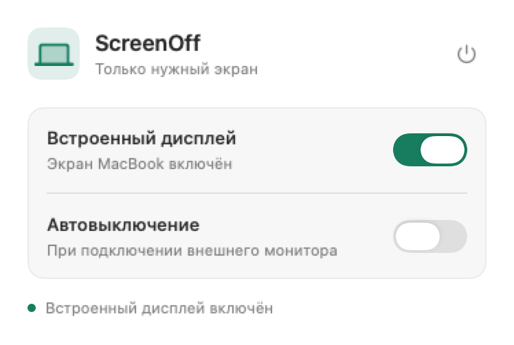

# ScreenOff

Небольшое нативное приложение для MacBook: отключает встроенный дисплей при работе с внешним монитором. Swift + SwiftUI + AppKit, без сторонних зависимостей.

В меню **два переключателя**:

- **Встроенный дисплей** — включить или отключить экран MacBook.
- **Автовыключение** — выключать экран при подключении внешнего монитора и запускать ScreenOff при входе в macOS.

Кнопка питания в заголовке завершает приложение и восстанавливает встроенный экран.



## Установка

1. Скачайте `ScreenOff-1.0.0-arm64.dmg` из [Releases](../../releases/latest).
2. Перетащите **ScreenOff.app → Applications**.
3. Запустите ScreenOff. Нажмите значок ноутбука в строке меню.

Сборка для **Apple Silicon, macOS 13+**. Системные драйверы, права администратора, Accessibility и Screen Recording не нужны.

Приложение подписано **ad-hoc**, без платного сертификата Apple Developer и нотариализации. Если скачанную сборку заблокирует Gatekeeper, после попытки запуска откройте **Системные настройки → Конфиденциальность и безопасность → Всё равно открыть**. Не отключайте Gatekeeper или SIP.

## Поведение

- Экран отключается на уровне конфигурации дисплеев WindowServer и исчезает из активного рабочего стола. Яркость и гамма не изменяются; чёрное окно поверх экрана не используется.
- Последний рабочий дисплей приложение не отключает. При отсоединении последнего активного внешнего монитора встроенный экран восстанавливается.
- Ручное включение имеет приоритет над автоматическим режимом до изменения набора внешних мониторов. События от самого переключения встроенного дисплея не сбрасывают этот выбор.
- Перед сном ScreenOff восстанавливает экран. После пробуждения даёт macOS время обнаружить мониторы и повторно применяет режим.
- Включение автовыключения регистрирует запуск при входе через `SMAppService.mainApp`. Если macOS требует согласия, меню показывает пояснение. Выключение отменяет автозапуск и включает экран.
- Позиции окон после повторного включения встроенного дисплея не восстанавливаются.
- При включённом видеоповторе приложение просит сначала отключить повтор в настройках macOS, чтобы не менять вашу схему зеркалирования.

## Совместимость и восстановление

Apple не предоставляет публичный API полного отключения отдельного дисплея. ScreenOff динамически загружает `SLSConfigureDisplayEnabled` / `CGSConfigureDisplayEnabled` и проверяет фактическое состояние после переключения. Обновление macOS может изменить закрытый API. При отсутствии нужных символов приложение запускается, но блокирует отключение с пояснением.

Настройки применяются только на время работы приложения (`forAppOnly`), без постоянного изменения конфигурации. Перед отключением запускается независимый `ScreenOffWatchdog`: он проверяет наличие внешнего экрана и heartbeat основного процесса. При аварии, потере связи или зависании дольше 8 секунд helper пытается включить встроенный экран. Восстановление использует текущий ID дисплея, а не сохранённый номер. Это дополнительные механизмы восстановления, а не гарантия от сбоев самой macOS.

Для ручного восстановления, в том числе когда приложение не запущено:

```sh
/Applications/ScreenOff.app/Contents/MacOS/ScreenOff --recover
```

Если API macOS не отвечает, закройте и откройте крышку либо переподключите монитор. Затем, если требуется, выйдите из учётной записи или перезагрузите Mac.

## Сборка и проверки

Нужны Xcode Command Line Tools, полный Xcode не требуется.

```sh
bash Scripts/test.sh       # проверки политики и условий восстановления
bash Scripts/build.sh      # dist/ScreenOff.app
bash Scripts/package.sh    # .app, .dmg, .zip и SHA256SUMS.txt
```

Диагностика без изменения экранов:

```sh
dist/ScreenOff.app/Contents/MacOS/ScreenOff --diagnose
```

Явный аппаратный тест при открытой крышке и подключённом внешнем мониторе (экран отключается примерно на две секунды и включается обратно):

```sh
dist/ScreenOff.app/Contents/MacOS/ScreenOff --hardware-test
```

Выполняйте его, предварительно завершив обычный экземпляр ScreenOff. Для подписания сертификатом Developer ID передайте `SIGNING_IDENTITY`. Нотариализация требует собственной учётной записи Apple Developer и выполняется отдельно. `ARCH=x86_64` позволяет собрать Intel-версию, однако работа отключения на Intel не проверена и не заявляется.

`bash Scripts/test-watchdog.sh` — отдельный аппаратный тест helper: отключает экран, закрывает канал heartbeat и проверяет восстановление, пока родительский процесс продолжает работать. Он также требует подключённого внешнего монитора и завершённого обычного экземпляра ScreenOff.

Подробности: [архитектура](Docs/Architecture.md), [результаты проверок](Docs/Verification.md).

## Удаление

Выключите автоматический режим, завершите приложение кнопкой питания и удалите ScreenOff.app. Если приложение уже удалено, его запись можно убрать из **Объектов входа** macOS. Отдельных постоянных служб нет. Единственное сохраняемое предпочтение — автоматический режим в домене `com.gevorg.screenoff`.

## Источники технических сведений

Код ScreenOff реализован самостоятельно. Сигнатуры закрытого API и особенности повторного обнаружения дисплея сверены с [MacDisplay](https://github.com/jjongkwann/MacDisplay/blob/main/core.swift) и описанием [NoLid](https://github.com/NicolasMarino/nolid). Время жизни конфигурации описано в [документации Apple](https://developer.apple.com/documentation/coregraphics/cgconfigureoption), автозапуск — в [SMAppService](https://developer.apple.com/documentation/servicemanagement/smappservice).

MIT License.
