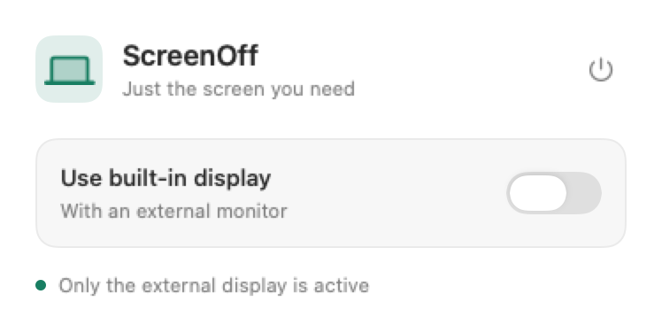

# ScreenOff

A small native MacBook app that disables the built-in display while you use an external monitor. Built with Swift, SwiftUI and AppKit, with no third-party dependencies.

**[Download for Mac](https://github.com/GevorgSogomonian/ScreenOff/releases/latest)** · [Report an issue](https://github.com/GevorgSogomonian/ScreenOff/issues/new/choose) · [Contribute](CONTRIBUTING.md)

**Apple Silicon (M1 or later), macOS 13+.** Download the DMG from the latest release's Assets section. The app is ad-hoc signed and is not notarized by Apple; installation instructions are below.

There is **one switch: “Use built-in display” with an external monitor**.

- **On:** use both displays.
- **Off:** automatically disable the MacBook display when an external monitor is connected, and restore it when the cable is disconnected.

ScreenOff runs **without a menu bar or Dock icon**. Press **⌘Space**, type **ScreenOff** and press Return to open settings. Closing the window leaves the app running in the background. Your display preference is saved.

The power button in the window quits ScreenOff and restores the built-in display.



## Installation

1. Download `ScreenOff-1.3.2-arm64.dmg` from [Releases](https://github.com/GevorgSogomonian/ScreenOff/releases/latest). When updating, first quit the old ScreenOff using the power button in its window.
2. Drag **ScreenOff.app → Applications** and replace the previous app if prompted.
3. Open ScreenOff to see its single-switch settings. Use Spotlight or Applications in Finder to reopen the window later.

The release targets **Apple Silicon, macOS 13+**. No system drivers, administrator privileges, Accessibility permission or Screen Recording permission are needed to run it.

The app is **ad-hoc signed**, without an Apple Developer certificate or notarization. If Gatekeeper blocks the downloaded app, first attempt to open it, then use **System Settings → Privacy & Security → Open Anyway**. Do not disable Gatekeeper or SIP.

## Behavior

- Switching to another application automatically hides the ScreenOff window, including when changing Stage Manager groups. This also applies outside Stage Manager. Display control continues in the background; reopening ScreenOff through Spotlight brings settings back. This is automatic window dismissal, rather than ordinary Stage Manager group membership.
- The display is disabled in WindowServer's display configuration and removed from the active desktop. Brightness and gamma are unchanged; ScreenOff does not cover the panel with a black window.
- ScreenOff does not disable the last usable display. Disconnecting the last active external monitor restores the built-in display.
- The switch saves your preference for external-monitor use. You can set it before connecting a monitor. Turning it on restores the built-in display immediately; turning it off disables the display when a suitable external monitor is connected.
- Locking the Mac immediately requests restoration, before closing the lid. Display sleep, system sleep and lid closure pause configuration attempts. Recovery continues after wake and lid opening; further disabling is blocked until restoration is confirmed.
- After unlock or wake, ScreenOff reapplies the saved preference even if the external monitor has not been reconnected. It waits for the displays to settle and the previous recovery helper to exit, which usually takes a few seconds. It does not start a new disable operation while the session is locked or inactive. Selecting both displays keeps both enabled.
- Turning the switch off enables automatic disabling and registers launch at login through `SMAppService.mainApp`. ScreenOff shows instructions if macOS requires approval. Turning the switch on unregisters this login item. Settings do not open automatically at login.
- Preferences from version 1.0.3 are preserved: the former automatic-off option being enabled corresponds to the current switch being off.
- Window positions are not restored when the built-in display returns.
- When display mirroring is enabled, ScreenOff asks you to turn it off in macOS settings before disabling the panel, preserving your mirroring configuration.

## Compatibility and recovery

Apple does not provide a public API for fully disabling an individual display. ScreenOff dynamically loads `SLSConfigureDisplayEnabled` / `CGSConfigureDisplayEnabled` and verifies the actual display state after changes. A macOS update can change this private API. If the required symbols are unavailable, ScreenOff opens but prevents disabling and explains why.

Disabling uses `forAppOnly`; enabling uses `forSession`. Neither permanently changes the configuration, but **exiting the process is not sufficient to undo the private disable** on the tested macOS build. An independent `ScreenOffWatchdog` remains responsible for recovery. The app and supervisor never perform a display-configuration call themselves: each change runs in a disposable child with a three-second timeout. Locking requests restoration immediately. Sleep and lid closure can cancel the child while the supervisor continues watching for wake. No new transaction starts before the previous child exits.

A timed-out transaction waits for a real wake, lid, session or external-topology change before retrying, preventing a continuous CPU/retry loop. With a closed lid or sleeping displays, the supervisor sends no configuration commands. It retains the remembered built-in ID and recovery obligation until the panel is confirmed active with the lid open. These changes address the reported lock → close lid → unplug recovery path. The owner confirmed that the installed 1.3.2 fix resolved the reported wake failure; this follow-up is user-reported validation on the affected Mac. See [Verification](Docs/Verification.md).

Since version 1.0.3, ScreenOff handles macOS removing the built-in display from enumeration and creating a virtual placeholder. It excludes that placeholder from external monitors and can recover using the last positively identified built-in display ID. This fallback is allowed only for enabling, with the lid open and no usable external display; a newly discovered ID always takes priority. These are recovery mechanisms, not a guarantee against macOS failures.

To request manual recovery, even when the app is not running:

```sh
/Applications/ScreenOff.app/Contents/MacOS/ScreenOff --recover
```

If the macOS API does not respond, close and open the lid or reconnect the monitor. If necessary, log out or restart the Mac.

## Building and testing

Install Xcode Command Line Tools; the full Xcode application is not required.

```sh
bash Scripts/test.sh       # Simulated recovery and real subprocess timeout checks
bash Scripts/build.sh      # dist/ScreenOff.app
bash Scripts/package.sh    # App, DMG, ZIP and SHA256SUMS.txt
```

Read-only display diagnostics:

```sh
dist/ScreenOff.app/Contents/MacOS/ScreenOff --diagnose
```

An explicit hardware test with the lid open and an external monitor connected disables the built-in display for about two seconds, then restores it:

```sh
dist/ScreenOff.app/Contents/MacOS/ScreenOff --hardware-test
```

Quit the ordinary ScreenOff instance before running hardware tests. Set `SIGNING_IDENTITY` to sign with a Developer ID certificate. Notarization requires your own Apple Developer account and is a separate step. `ARCH=x86_64` can build an Intel version, but Intel display disabling has not been validated and is not claimed as supported.

`bash Scripts/test-watchdog.sh` is a separate hardware test: it disables the display, closes the heartbeat channel and checks independent restoration while the parent remains alive. It also requires an external monitor and the ordinary ScreenOff instance to be closed.

`bash Scripts/test-interface.sh` checks background startup, absence of Dock and menu bar icons, window sizing and closing, focus-loss dismissal, and reopening the same process through LaunchServices (the Spotlight/Finder path). It uses isolated preview applications and does not control physical displays.

`bash Scripts/test-restore-only.sh` checks the real helper through a restore command, channel closure and restore-mode startup. The built-in display must already be enabled; this test sends no disable commands.

See [Architecture](Docs/Architecture.md) and [Verification](Docs/Verification.md) for details.

## Uninstalling

Turn on “Use built-in display,” quit with the power button and delete ScreenOff.app. If you already deleted the app, remove its entry from macOS **Login Items**. No separate persistent services are installed. The display preference is stored in the `com.gevorg.screenoff` defaults domain.

## Technical references

ScreenOff is an independent implementation. Private API signatures and display rediscovery behavior were checked against [MacDisplay](https://github.com/jjongkwann/MacDisplay/blob/main/core.swift) and the [NoLid description](https://github.com/NicolasMarino/nolid). Configuration lifetime is documented in [Apple's CGConfigureOption reference](https://developer.apple.com/documentation/coregraphics/cgconfigureoption), and login registration in [SMAppService](https://developer.apple.com/documentation/servicemanagement/smappservice).

MIT License.

## Contributing

Report bugs and suggestions in [Issues](https://github.com/GevorgSogomonian/ScreenOff/issues/new/choose). Use English for reports, discussions, code comments and documentation. To contribute code, fork the repository and open a pull request against `main`; the owner reviews and merges changes. Public access does not grant permission to modify the repository directly or publish releases. See [CONTRIBUTING.md](CONTRIBUTING.md) for details and validation commands.
